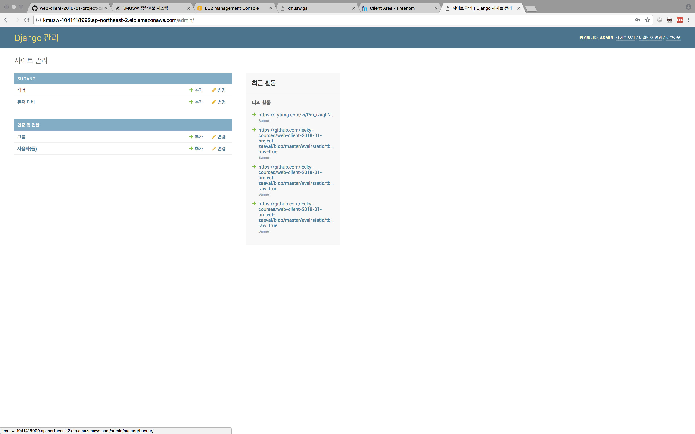
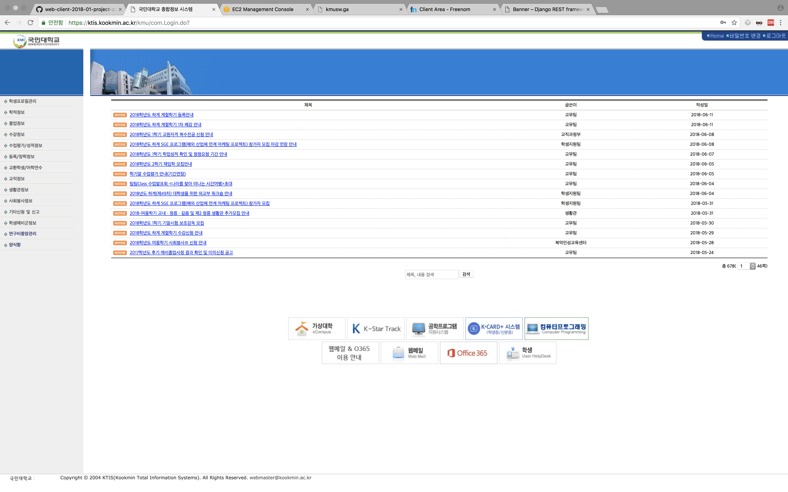

# KMUSW 종합정보 시스템 
    "본 사이트" 는 기존 종합시스템의 개정안이 아닌 SW과 만의 확장기능 버전입니다.
    
## Structure design

```
body    
│
└───main
    │  
    └───header
    │  
    └───nav
    │   │   
    │   │   section  
    │   │   section
    │   └───...
    │  
    └───section
    └───... 
    
```

## Change Log (중간 고사 이후)

* ### 기존 nav-section 부분들 animation-delay

    #### index.html
    ```html
    <section class="nav-section box-shadow fade-in animated delay3 ">    
    <section class="nav-section box-shadow fade-in animated delay6 ">    
    <section class="nav-section box-shadow fade-in animated delay9 ">    
    <section class="nav-section box-shadow fade-in animated delay12 ">  
    ...
    ```
    #### index.css
    ```css
    .delay3 {
        animation-delay: .3s;
    }

    .delay6 {
        animation-delay: .6s;
    }

    .delay9 {
        animation-delay: .9s;
    }

    .delay12 {
        animation-delay: 1.2s;
    }
    ...
    ```
    기존에 클래스를 각 딜레이에 맞춰서 따로따로 해주었다. 이 경우 이후 메뉴의 확장성을 고려 하면 index.html에 추가할 nav-section의 경우에 fade-in animated delay{num}을 추가해주어야하고 그에 맞는 딜레이를 가지는 css또한 추가해주어야 한다.
    
    이와 같은 이유로 확장성에 대해서 매우 불편 할 수 있기 때문에 다음과 같이 바꾸어 주었다.
    #### index.html
    ```html
    <head>
        ...
        <script src="static/index.js"/>
        ...
    </head>
    <body>
        ...
        <section class="nav-section box-shadow">    
        <section class="nav-section box-shadow">    
        <section class="nav-section box-shadow">    
        <section class="nav-section box-shadow">  
        ...
    </body>
    ```
    #### index.js
    ```javascript
    var delay = 300;
    $(document).ready(
        function(){
            var navMenus = $(".nav-wrapper").find('section');
            for(var i = 0; i<navMenus.length; ++i){
                var second = delay * i / 1000;
                $(navMenus[i]).css('animation-delay', second+'s');

                $(navMenus[i]).addClass('fade-in animated');

            }
        }
    );
    ```
    
    이 경우엔 html에만 nav-section(메뉴)를 추가하면 자동적으로 딜레이가 한번 더 되어 로딩 되게 된다.
    
* ### body background-image가 안의 요소들보다 늦게 로딩 되는 점

    #### 문제 분석 및 조사
        1. background-image 속성은 image load event handler가 없다.
        2. img 태그에는 image load event handler가 존재.
        3. 한번 로드된 이미지는 캐시에 저장되어있고, 다시 똑같은 이미지를 불러올 때, 이 캐시를 참조한다.

    #### 개선 방안
    
        1. jquery를 이용하여 가상의 img Tag를 이용하여 먼저 이미지를 로드한다.
        2. 이 가상의 img Tag 로드 이벤트 핸들러에 만들어둔 가상의 img를 메모리에서 지우기 위해 img Tag를 remove 한다.
        3. 로드 된 이미지는 웹브라우저의 캐시로 남아 있으므로 이상태에서 body의 background-image style로 
        삽입하면 바로 로딩이 되고, 이미지 로드 이벤트를 달아놨기 때문에 이후에 다른 요소들을 띄울 수 있다.

    #### index.js
    
    ```javascript
    var delay = 300;
    $(document).ready(
        function () {
            $('').attr('src', 'static/ktis-background.png').on('load', function () {
                $(this).remove();
                $('body')
                    .css('background-image', 'url(static/ktis-background.png)');
                $('body').fadeIn(1500, function () {
                        var navMenus = $(".nav-wrapper").find('section');
                        for (var i = 0; i < navMenus.length; ++i) {
                            var second = delay * i / 1000;
                            $(navMenus[i]).css({
                                'animation-delay': second + 's',
                                'display': 'inline-block'
                            });
                            $(navMenus[i]).addClass('fade-in animated');

                        }
                    });

            });
        }
    );

    ```
    
* ### 배너(banner)
    
    
    `위 사진은 로버트 부르스 배너(헐크)로 읽기 지루할까봐 넣은, 내용과는 무관한 사진이다.`
    
    
    기존 배너는 위와 같은 양쪽 버튼, 인디케이터, 배너 이미지 와같이 구성하였고,
    양쪽 버튼을 누르면 좌우로 다음, 이전 이미지가 스와이프 된다.
    #### index.html
    
    ```html
    <input type="radio" name="buttons" id="banner-right-button-check" checked>
    <input type="radio" name="buttons" id="banner-left-button-check">
    <input type="radio" name="buttons" id="first-banner-right-button-check" checked>
    <input type="radio" name="buttons" id="second-banner-right-button-check">
    <input type="radio" name="buttons" id="third-banner-right-button-check">
    <input type="radio" name="buttons" id="first-banner-left-button-check">
    <input type="radio" name="buttons" id="second-banner-left-button-check">
    <input type="radio" name="buttons" id="third-banner-left-button-check">

    <label class="left-button" id="first-banner-left-button" for="first-banner-left-button-check"><span>&laquo;</span></label>
    <label class="right-button" id="first-banner-right-button" for="first-banner-right-button-check"><span>&raquo;</span></label>
    <label class="left-button" id="second-banner-left-button" for="second-banner-left-button-check"><span>&laquo;</span></label>
    <label class="right-button" id="second-banner-right-button" for="second-banner-right-button-check"><span>&raquo;</span></label>
    <label class="left-button" id="third-banner-left-button" for="third-banner-left-button-check"><span>&laquo;</span></label>
    <label class="right-button" id="third-banner-right-button" for="third-banner-right-button-check"><span>&raquo;</span></label>
    <label class="left-button" id="first-banner-left-button" for="first-banner-left-button-check"><span>&laquo;</span></label>
    <label class="right-button" id="first-banner-right-button" for="first-banner-right-button-check"><span>&raquo;</span></label>
                    
    <article id="banner-first"></article>
    <article id="banner-second"></article>
    <article id="banner-third"></article>

    <div class="banner-indicators box-shadow"><label for="first-banner-right-button-check"></label></div>
    <div class="banner-indicators box-shadow"><label for="second-banner-right-button-check"></label></div>
    <div class="banner-indicators box-shadow"><label for="third-banner-right-button-check"></label></div>

    ```
    
    기존에는 banner-article 3개와 오른쪽 버튼 3개, 좌측 버튼 3개, 각각의 버튼이 눌렸는지 안눌렸는지를 순수 css 만으로 체크하기 위해서 input tag 6개 생성 indicator 3개 총 18개의 object가 메모리에 올라가게되고 이는 비효율적인 방법이다. 게다가 메뉴와 같이 확장성을 고려했을 때, 배너의 갯수가 바뀌었을 때, 굉장히 수정할 부분이 많아 지는 부분을 볼 수 있다.
    
    #### banner.css
    ```css
    #second-banner-right-button-check:checked ~ #second-banner-right-button {
        display: none;
    }

    #second-banner-right-button-check:checked ~ #third-banner-left-button {
        display: none;
    }

    #second-banner-right-button-check:checked ~ #first-banner-right-button {
        display: none;
    }

    #second-banner-right-button-check:checked ~ #first-banner-left-button {
        display: none;
    }

    #second-banner-right-button-check:checked ~ #third-banner-right-button {
        display: table;
    }

    #second-banner-right-button-check:checked ~ #second-banner-left-button {
        display: table;
    }

    #first-banner-right-button-check:checked ~ #first-banner-right-button {
        display: none;
    }

    #first-banner-right-button-check:checked ~ #second-banner-left-button {
        display: none;
    }

    #first-banner-right-button-check:checked ~ #third-banner-right-button {
        display: none;
    }

    #first-banner-right-button-check:checked ~ #first-banner-left-button {
        display: none;
    }

    #first-banner-right-button-check:checked ~ #second-banner-right-button {
        display: table;
    }

    #first-banner-right-button-check:checked ~ #third-banner-left-button {
        display: table;
    }

    ...
    ```
    위와 같은 식으로 label의 for 속성을 이용해서 input이 체크가 되면 그 형제인 버튼들을 다음 버튼을 제외한 나머지 버튼들을 지우고 다음 선택을 위한 버튼은 활성화 시킨다. 이경우에 총 36가지의 경우가 나온다... 위 부분은 오직 버튼 활성화에 대한 css소스 이고
    화면 전환에 관한 css소스는 왼쪽버튼을 눌렀을때, 오른쪽 버튼을 눌렀을때 두가지에다가 세 화면이고 각각 화면이 전환 되려면 사라지는 애니메이션, 나타나는 애니메이션 두가지 로써  3x2x2 인 12가지가 나온다.
    
    #### banner.css
    ```css
    #second-banner-right-button-check:checked ~ #banner-second {
        animation-name: fadeInRight;
        animation-duration: .5s;
        animation-fill-mode: both;
        }

    #second-banner-right-button-check:checked ~ #banner-first {
        animation-name: fadeOutLeft;
        animation-duration: .5s;
        animation-fill-mode: both;
    }
    
    ...
    ```
    위와 같은 식이다. 이것을 javascript 클래스와 간단한 Django서버를 작성하여 banner를 동적으로 추가하고 삭제 할 수 있도록 수정하였다.
    
    django의 서버는 이번 수업에선 웹클라이언트 수업이기 때문에 필요한 요소들만 다루도록 한다.
    
    https://beautiself.ga/admin/
    
    이 주소가 django에서 지원하는 완성된 admin app부분이다. 
    
    
    
    id : admin
    password : #include
    
    이고 이를 통해 접속했을 때,
    
    
    
    이러한 화면이 뜨는데 배너에서 image_url 을 추가하거나 삭제 및 변경을 할 수 있다.
    
    이렇게 추가한 데이터들을 
    
    https://beautiself.ga/banner
    
    
    
    JSON notation으로 restful하게 리턴하도록 Django app을 만들었다.
    
    이후에 이것을 동적으로 웹사이트에서 구성하기 위해서, ajax라는 비동기식 http 호출을 통해 이 데이터를 받아오고 엘리먼트를 감싼 객체를 만들어서 동적으로 banner-section에 append해주었다.

    #### banner.js
    ```javascript
    function Banner(src) {
        this.src = src;
        this.html = $('<article></article>');
        this.html.find('img').attr('src', src);
        this.indicator = new Indicator();
    }
    Banner.prototype.append = function (target) {
        $(target).append(this.html);
        $(target).append(this.indicator.html);
    };
    Banner.prototype.fadeOutLeft = function () {
        this.html.css({
            "animation-name": "fadeOutLeft",
            "animation-duration": ".5s",
            "animation-fill-mode": "both"
        });
    };
    Banner.prototype.fadeOutRight = function () {
        this.html.css({
            "animation-name": "fadeOutRight",
            "animation-duration": ".5s",
            "animation-fill-mode": "both"
        });
    };
    Banner.prototype.fadeInRight = function () {
        this.html.css({
            "animation-name": "fadeInRight",
            "animation-duration": ".5s",
            "animation-fill-mode": "both"
        });
    };
    Banner.prototype.fadeInLeft = function () {
        this.html.css({
            "animation-name": "fadeInLeft",
            "animation-duration": ".5s",
            "animation-fill-mode": "both"
        });
    };

    function Indicator(){
        this.width = "20px";
        this.background_color = "#E8EAF6";
        this.html = $('<div class="banner-indicators box-shadow"><label></label></div>');
    }
    Indicator.prototype.select = function(check){
        if(check){
            this.width = "8px";
            this.background_color = "#283593";
        }
        else{
            this.width = "20px";
            this.background_color = "#E8EAF6";
        }
        this.html.css(
            {
                "width":this.width,
                "background-color":this.background_color
            }
        );
    }
    ```
    
    Banner 클래스의 속성으로 src 와 한 배너 이미지를 구성할 엘리먼트 객체, indicator 객체를 생성해줬다.
    그리고 프로토타입으로 css로 12가지의 경우의 수로 정적 세팅 되어있었던 애니메이션 부여를 그대로 따와 객체에 binding 해두었다.
    Indicator 클래스의 속성으로 css에서 transition할때, width와 background-color만 변화 시켰기때문에 그것을 가지고 있게 설계하였다. 현재 소스에서는 딱히 필요없지만 이후에 갯수에 따라 너비 비율 조정도 따로 해야할 것이고, 색깔도 커스텀 마이징 할 수 있게 하는등 확장성을 고려하여 속성으로 포함하였다.
    
    #### index.js
    ```javascript
    $.ajax({
        url: server_domain + 'api/banner',
        type: 'get',
        dataType: 'json',
        success: function (data) {
            if (data.status) {
                for (key in data.content) {
                    var banner = new Banner(data.content[key].image_url);
                    banner.append($(".nav-banner"));
                    banners.push(banner);
                }
                banners[0].html.css("left", 0);
                banners[0].indicator.select(true);
            }
        },
        error: function (result) {
            alert(result);
        }
    });
    ```
    https://beautiself.ga/banner 에 http request를 보내고 받은 json을 파싱해서 banner를 생성해주고 초기 세팅을 해준 것이다.
    
     #### index.js
    ```javascript
    function bannerSlidLeft() {

        var next_banner = banners.pop();
        var current_banner = banners[0];

        next_banner.indicator.select(true);
        current_banner.indicator.select(false);

        next_banner.fadeInRight();
        current_banner.fadeOutLeft();

        banners.unshift(next_banner);

    }

    function bannerSlidRight() {

        var current_banner = banners.shift();
        var next_banner = banners[0];

        current_banner.indicator.select(false);
        next_banner.indicator.select(true);

        current_banner.fadeOutRight();
        next_banner.fadeInLeft();

        banners.push(current_banner);

    }
    ```
    기존에 있던 css기능(오른쪽 버튼을 누르면 오르쪽 슬라이드, 왼쪽 버튼을 누르면 왼쪽으로 슬라이드) 하는 방식.
    을 Array의 pop과 shift의 특성을 이용해 banner객체들이 순환하도록 만들었다. 
    
    이를 각각의 버튼에 이벤트로써 달아줬다.
    ```javascript
    $('.left-button').click(bannerSlidLeft);
    $('.right-button').click(bannerSlidRight);
    ```
    
    이에 대한 효과로 banner.css의 코드 길이는 300줄 이상에서 100줄 이하로 줄어 들게 되었고,
    DOM object들도 불필요한 객체들이 제거 되었다.
    
* ### 회원가입 및 로그인 인터렉션

    이 역시 label과 input태그를 이용해 nav 클릭시 팝업이 뜨도록 하였으나, transition의 꼬임으로 인해
    원할하지 못한점에 대해서 jquery를 사용해 개선하였다.
    
    #### nav-section.js
    ```javascript
    function NavSection(element, targetWindow, width, height) {
        this.targetWindow = $(targetWindow);
        this.element = $(element);
        this.width = width;
        this.height = height;
        this.element.click({
            this: this
        }, this.fadeIn);
        this.targetWindow.click({
            this: this
        }, this.fadeOut);
    }
    NavSection.prototype.fadeIn = function (event) {
        $(event.data.this.targetWindow.find('.wraper-floating-session')[0]).unbind('click');
        $(event.data.this.targetWindow.find('.wraper-floating-session')[0]).click(function () {
            return false;
        });

        event.data.this.targetWindow.css(
            'z-index', '100'
        );
        $(event.data.this.targetWindow.find('.wraper-floating-session')[0]).css({
            'top': "calc(50% - " + event.data.this.height / 2 + "px)",
        });
        event.data.this.targetWindow.animate({
                'opacity': '1',
            }, 250,
            function () {
                $(event.data.this.targetWindow.find('.wraper-floating-session')[0]).animate({
                        'width': event.data.this.width + "px",
                        'height': event.data.this.height + "px",
                        'opacity': '1',

                    }, 200,
                    function () {
                        $(event.data.this.targetWindow.find('.wraper-floating-session')[0]).addClass('top-of-z-index');
                        $(event.data.this.targetWindow.find('.wraper-floating-session')[0]).find('*').animate(
                            {'opacity': '1'},
                            300,function(){}
                        ).delay(100);
                    }
                );
            }
        );
    };
    NavSection.prototype.fadeOut = function (event) {
        $(event.data.this.targetWindow.find('.wraper-floating-session')[0]).unbind('click');
        $(event.data.this.targetWindow.find('.wraper-floating-session')[0]).find('*').css(
            'opacity', '0'
        );
        event.data.this.targetWindow.animate({
                'opacity': '0',
            }, 200,
            function () {
                event.data.this.targetWindow.css(
                    'z-index', '0'
                );
            }
        );
        $(event.data.this.targetWindow.find('.wraper-floating-session')[0]).animate({
                'opacity': '0',
                'width': '0',
                'height': '0',
            }, 150,
            function () {
                $(event.data.this.targetWindow.find('.wraper-floating-session')[0]).removeClass('top-of-z-index');
            }
        );

    };
    ```
    위와 같이 클래스를 만들어 두고
    #### index.js
    ```javascript
    var loginSection = new NavSection($('#nav-login'), $('#login-session'), 500, 400);
    var registerSection = new NavSection($('#nav-register'), $('#register-session'), 500, 400);
    ```
    이렇게 딱 두줄만 사용하면 끝난다. 인자의 내용은
    
        - 첫번째 인자 : nav 종류
        - 두번째 인자 : 팝업 종류
        - 세번째 인자 : 팝업의 width
        - 네번째 인자 : 팝업의 height
    
    이다.
    
    이부분을 하면서 어려웠던 점이 css으로 구현했을 때는, input과 label로 정확하게 딱딱 집어서 event listener가 잡히는데,
    jQuery로 바꾸면서, 부모에 리스너를 달았더니 자식에도 클릭이 되는 bubbling 현상이 생겼다. 이를 고치는 방법으로는 리스너를 css때 구현한거처럼 따로따로 달아주는 방법, 리스너 버블링 옵션을 끄는 방법, 리스너를 덮어씌워서 막는 방법(return false하면 아무런 역할도 하지않고 이벤트 핸들러가 종료된다.)이중에 첫번째 작업은, 쓸데없는 오브젝트를 생성하는 것이므로 패스, 두번째 방법이 가장 괜찮아 보였지만, jQuery에서 하는 방법을 찾다가 시간이 너무 오래걸려서 이역시 패스하고, 마지막 방법으로 구현하였다.
    
    마지막 방법의 경우 문제점은, event handler는 오버라이트 되는것이 아니라 append되는 방식이라 똑같은 이벤트 핸들러를 여러번 정의 해주면 그만큼 자원을 잡아 먹는다. 이 때문에 정의 해주기 전에 unbind를 해주었다.
    
    
* ### 회원가입 및 로그인 버그

    
    
    기존 로그인은 https://ktis.kookmin.ac.kr/kmu/com.Login.do? 이 주소로 post요청을 보내 로그인을 하는 형태라
    ktis.kookmin.ac.kr로 리다이렉션이 되는 버그가 있다.
    
    
    이 때문에, ktis.ac.kr을 파싱해 서버를 구축하고 회원가입은 ktis.kookmin.ac.kr에서 인증해서 정보를 가져오는 형태로써
    구현을 하였다.
    
    https://github.com/zaeval/ktis-parser 간단하게 파싱하는 라이브러리를 만들어 보았다. (스타좀 눌러주십시오.)
    ```javascript
    
    loginSection.targetWindow.find("[type='submit']").click(function () {

        $.ajax({
             url: server_domain + 'api/login',
            type: 'post',
            data: $(loginSection.targetWindow.find("form")[0]).serialize(),
            dataType: 'json',
            success: function (data) {
                if (data.status) {
                    var multiline = $(' <footer><div class="multiline"></div> </footer>');
                    for(var key in data.content){
                        if(key=='vaildiate' || key == 'id' || key == 'passwd')
                            continue;
                            
                        multiline.children().append(key + ": "+data.content[key]+"<br/>");
                    }
                    loginSection.element.html(multiline);
                    loginSection.targetWindow.fadeOut();
                }
            },
            error: function (result) {
                alert(result.responseJSON.content);
            }
        });
    });
    registerSection.targetWindow.find("[type='submit']").click(function () {

        $.ajax({
            url: server_domain + 'api/register',
            type: 'post',
            data: $(registerSection.targetWindow.find("form")[0]).serialize(),
            dataType: 'json',
            success: function (data) {
                if (data.status) {
                    alert("회원가입 완료!");
                        registerSection.targetWindow.fadeOut();
                        
                }
            },
            error: function (result) {
                alert(result.responseJSON.content);
            }
        });
    });
    ```
    서버와 연동한 소스 부분이다. 연동하고 login시 받아오는 값을 토대로 로그인 nav부분의 값을 대체했다.
    

## 앞으로의 계획 및 느낀점

현재 강의 계획서 열람 부분에 대해서 parser 구현을 완료하였고, 그부분 페이지는 vue.js라는 mvvm모델의 클라이언트 프레임워크를 써서 따로 만들 예정이다. 이번 페이지에 따로 만든 페이지를 결합해서 실제로 운영해볼 계획이고, 수강 모의 신청 페이지는 현재 vue.js componnent를 작성중에 있고 사물함 신청 페이지는 UI 구상중에 있다. 이번에 이런저런 방법으로 하면서 ES나 클라이언트 프레임 워크, 웹팩등을 왜 쓰는지 좀 더 몸으로 느낄 수 있었다. 이런 기회가 있어서 좀더 성장 할 수 있는 계기가 되지 않았나 싶다. 감사합니다.

## 2020/05/24 update log
https://github.com/zaeval/ktis-parser
ktis-parser 작동 확인 했습니다! 잘 활용해주세요!
    
